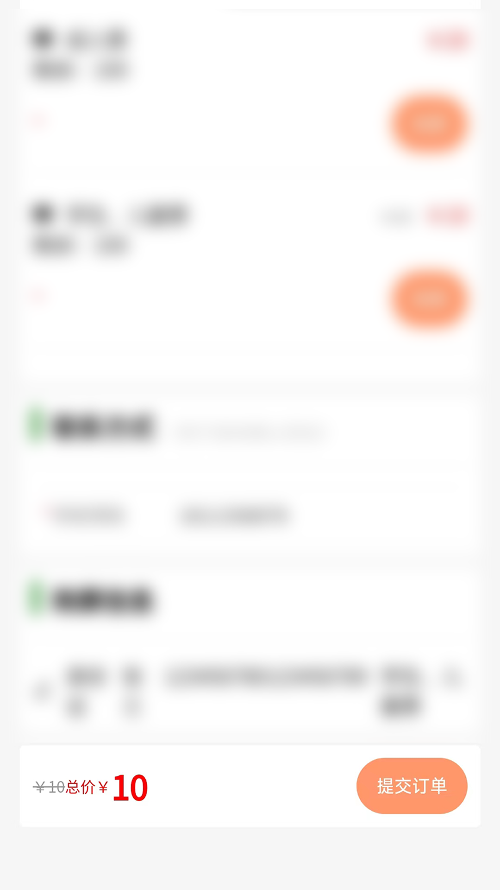
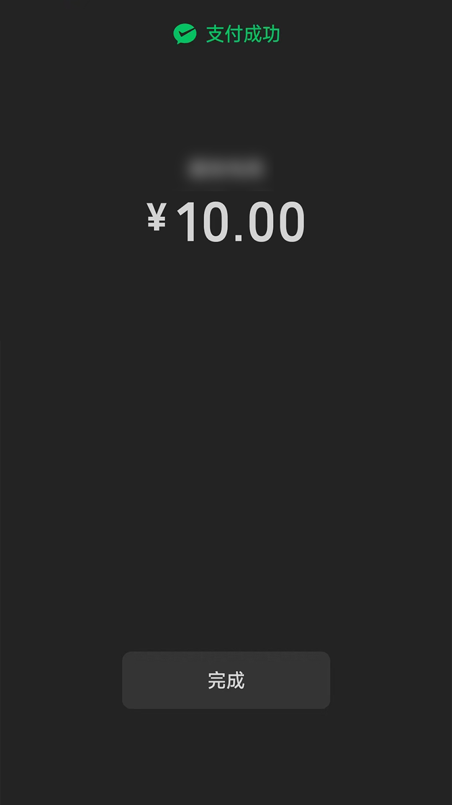
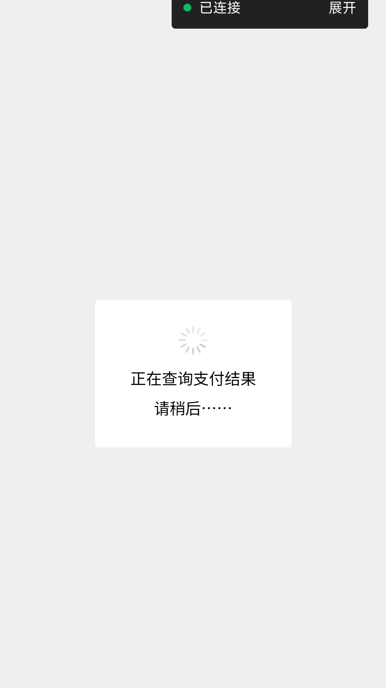
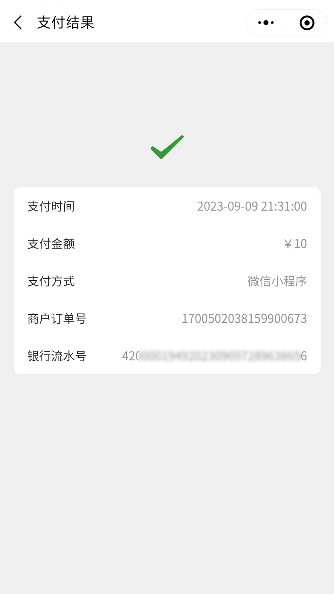

# 微信小程序支付

当下，微信小程序十分火爆，现在无论是购物还是生活服务，都是推荐你使用微信小程序，主要是它无需下载安装就可以使用，让手机变得非常清爽，给用户也带来很大的方便之处。

今天给大家分享的是，微信小程序 API v3 支付。

## 目录

1、效果演示
2、微信小程序支付官方文档
3、生成密钥、生成证书
4、如何生成签名
5、微信小程序下单接口
6、微信小程序商户订单查询接口

## 一、效果演示

步骤1：用户选择好商品，提交订单，服务端下预订单



步骤2：小程序端拉起支付控件，并完成支付



步骤3：查询支付结果



步骤4：完成支付，显示支付结果



## 二、微信小程序支付官方文档

- 2.1 [API v3 密钥](https://pay.weixin.qq.com/docs/merchant/development/interface-rules/apiv3key.html)
- 2.2 [如何生成请求签名](https://pay.weixin.qq.com/docs/merchant/development/interface-rules/signature-generation.html)
- 2.3 [小程序下单接口](https://pay.weixin.qq.com/docs/merchant/apis/mini-program-payment/mini-prepay.html)
- 2.4 [商户订单号查询订单接口](https://pay.weixin.qq.com/docs/merchant/apis/mini-program-payment/mini-prepay.html)

## 三、生成密码，生成证书

看 【2.1】文档，生成 API v3 密钥 和 API 证书。

注意：

1、生成证书，需要配合客户端软件（WXCertUtil）生成。
2、附件中的三份文件（证书pkcs12格式、证书pem格式、证书密钥pem格式）。建议读一读 `证书使用说明.txt`。

## 四、生成签名

这一步是相当复杂，我们一定要把【2.2】文档多读几遍。

先说结论，这一步主要是构建下面这样一个东西：

```
Authorization: 认证类型 签名信息
```

认证类型是 `WECHATPAY2-SHA256-RSA2048`。

签名信息：
- 发起请求的商户（包括直连商户、服务商或渠道商）的商户号mchid
- 商户API证书序列号serial_no，用于声明所使用的证书
- 请求随机串nonce_str
- 时间戳timestamp
- 签名值signature

商户号 mchid，这个拿到了。
商户API证书序列号serial_no，这个有两种方式，一是从证书（p12）文件中获取，二是在后台查看：【API安全 > 申请API证书 > 点击“管理证书” > “证书序列号”】

下面就来重点说一下这个签名了。

格式：

```
HTTP请求方法\n
URL\n
请求时间戳\n
请求随机串\n
请求报文主体\n
```

HTTP请求方法，每个接口都不一样，比如下单接口是POST，查询接口是GET。

URL，这是是除去域名，后面的全部。官方文档是这样说的：
> 第二步，获取请求的绝对URL，并去除域名部分得到参与签名的URL。如果请求中有查询参数，URL末尾应附加有'?'和对应的查询字符串。

请求时间戳，这个是秒数。

接口报文体，官网也说的比较详细，

```
第五步，获取请求中的请求报文主体（request body）。

请求方法为GET时，报文主体为空。
当请求方法为POST或PUT时，请使用真实发送的JSON报文。
图片上传API，请使用meta对应的JSON报文。
对于下载证书的接口来说，请求报文主体是一个空串。
```

综合起来，就是这样的，举个例子：

```
GET\n 
/v3/certificates\n 
1554208460\n 
593BEC0C930BF1AFEB40B4A08C8FB242\n 
\n
```

下一个难点来了，计算签名。

签名方式：使用商户私钥对待签名串进行SHA256 with RSA签名，并对签名结果进行Base64编码得到签名值。

简单来说，
1：就是先要读到商户私钥，
2：然后使用私钥进行SHA256 with RSA签名，
3：Base64编码

到这里，就算得到 Authorization 的值了。

## 五、微信小程序下单接口

下面我们就以小程序下单接口来做说明。

首先，构造下单的参数

```java
WechatAppletPayRequest request = new WechatAppletPayRequest();
request.setAppId(merchantConfigBo.getAppId());
request.setMchId(merchantConfigBo.getMchId());
request.setDescription("演示订单");
request.setOutTradeNo(orderId);
request.setNotifyUrl("https://examine.com/pay/notify");
request.setAmount(amount);
request.setPayer(payer);
```

这里需要说明的，过期时间（time_expire）格式为：`yyyy-MM-DDTHH:mm:ss+TIMEZONE`。

应该如何赋值呢？

```java
LocalDateTime timeExpire = LocalDateTime.now().plusMinutes(30);
OffsetDateTime offsetDateTime = OffsetDateTime.of(timeExpire, ZoneOffset.of("+8"));
String timeExpireStr = offsetDateTime.format(DateTimeFormatter.ofPattern("uuuu-MM-dd'T'HH:mm:ssXXX"));
request.setTimeExpire(timeExpireStr);
```

我们对请求参数进行 json 格式转换：

```java
String param = JsonUtils.convertString(request);
```

获取证书：

```java
public KeyPair createPKCS12(String keyPath, String keyAlias, String keyPass) {
    try {
        char[] pem = keyPass.toCharArray();
        InputStream inputStream = new FileInputStream(keyPath);
        synchronized (lock) {
            if (store == null) {
                synchronized (lock) {
                    store = KeyStore.getInstance("PKCS12");
                    store.load(inputStream, pem);
                }
            }
        }
        X509Certificate certificate = (X509Certificate) store.getCertificate(keyAlias);
        certificate.checkValidity();
        // 证书的序列号 也有用
        String serialNumber = certificate.getSerialNumber().toString(16).toUpperCase();
        // 证书的 公钥
        PublicKey publicKey = certificate.getPublicKey();
        // 证书的私钥
        PrivateKey storeKey = (PrivateKey) store.getKey(keyAlias, pem);

        return new KeyPair(publicKey, storeKey);

    } catch (Exception e) {
        throw new IllegalStateException("Cannot load keys from store: " + keyPath, e);
    }
}
```

获取到证书，就可以用私钥进行签名

```java
public static String sign(String url, 
                          String method, 
                          long timestamp, 
                          String nonceStr, 
                          String body, 
                          KeyPair keyPair)  {
    try {
        String canonicalUrl = getCanonicalUrl(url);
        String signatureStr = Stream.of(method, canonicalUrl, String.valueOf(timestamp), nonceStr, body)
                .collect(Collectors.joining("\n", "", "\n"));
        Signature sign = Signature.getInstance("SHA256withRSA");
        sign.initSign(keyPair.getPrivate());
        sign.update(signatureStr.getBytes(StandardCharsets.UTF_8));
        return Base64.getEncoder().encodeToString(sign.sign());
    } catch (Exception e) {
        throw new RuntimeException(e);
    }
}
```

然后进行拼接：

```java
private String getToken(String mchId, String nonceStr, long timestamp, String serialNo, String signature) {
    final String TOKEN_PATTERN = "mchid=\"%s\",nonce_str=\"%s\",timestamp=\"%d\",serial_no=\"%s\",signature=\"%s\"";
    // 生成token
    return String.format(TOKEN_PATTERN,
            mchId,
            nonceStr, timestamp, serialNo, signature);
}
```

最后就是用http工具发起请求：

```java
private String httpPost(String url, String token, String param) {
    Map<String, String> headerMap = new HashMap<>();
    headerMap.put("Accept", "application/json");
    headerMap.put("Content-Type", "application/json");
    headerMap.put("Authorization", "WECHATPAY2-SHA256-RSA2048 " + token);

    Request request = new Request();
    request.setUrl(url);
    request.setParam(param);
    request.setMethod(Request.Method.POST);
    request.setUtil(Request.Util.OkHttp);
    request.setParamFormat(Request.ParamFormat.JSON);

    Request.Option option = new Request.Option();
    option.setHeaders(headerMap);

    try {
        return HttpUtils.execute(request, option);
    } catch (IOException e) {
        throw new RuntimeException(e);
    }
}
```

以上就是post方式请求微信 API v3 接口

## 六、微信小程序商户订单查询接口

支付查询是GET方式，如果你没有仔细看第【四】点，可能会遇到一些问题

我们先构造url：

```java
String payQueryUrl = "https://api.mch.weixin.qq.com/v3/pay/transactions/out-trade-no/%s";
String url = String.format(payQueryUrl, dto.getOutTradeNo());
url += "?mchid=" + merchantConfigBo.getMchId();
```

签名时，获取url需要注意，参数也需要带上

```java
public static String getCanonicalUrl(String url) {
    try {
        URL u = new URL(url);
        String query = u.getQuery();
        String result = u.getPath();
        if (StringUtils.hasText(query)) {
            result = result + "?" + query;
        }
        return result;
    } catch (Exception e) {
        throw new RuntimeException(e);
    }
}
```

请求方法为GET时，报文主体为空。

```java
private String httpGet(String url, String token) {
    Map<String, String> headerMap = new HashMap<>();
    headerMap.put("Accept", "application/json");
    headerMap.put("Content-Type", "application/json");
    headerMap.put("Authorization", "WECHATPAY2-SHA256-RSA2048 " + token);

    Request request = new Request();
    request.setUrl(url);
    request.setMethod(Request.Method.GET);
    request.setUtil(Request.Util.OkHttp);

    Request.Option option = new Request.Option();
    option.setHeaders(headerMap);

    try {
        return HttpUtils.execute(request, option);
    } catch (IOException e) {
        throw new RuntimeException(e);
    }
}
```

## 小程序调起支付

最后，补充一下，在小程序端如何拉起支付：

文档：
- [小程序调起支付签名](https://pay.weixin.qq.com/docs/merchant/apis/mini-program-payment/mini-transfer-payment.html)
- [小程序支付](https://developers.weixin.qq.com/miniprogram/dev/api/payment/wx.requestPayment.html)

小程序调起支付，需要 `appId`，也需要签名。

AppId 这种一般都会配到后台，所以，建议签名放到后台，如下：

```java
public static String paySign(String appid, String packageStr, long timestamp, String nonceStr, KeyPair keyPair) {
    try {
        String message = appid + "\n"
                + timestamp + "\n"
                + nonceStr + "\n"
                + packageStr + "\n";
        //签名方式
        Signature sign = Signature.getInstance("SHA256withRSA");
        sign.initSign(keyPair.getPrivate());
        sign.update(message.getBytes(StandardCharsets.UTF_8));
        return Base64.getEncoder().encodeToString(sign.sign());
    } catch (Exception e) {
        throw new RuntimeException(e);
    }
}
```

只需要将签名号的参数返回给小程序就好了。

```
wx.requestPayment({
    timeStamp: payVo.timeStamp,
    nonceStr: payVo.nonceStr,
    package: payVo.packageStr,
    signType: 'RSA',
    paySign: payVo.paySign,
    success (res: any) { 
        wx.navigateTo({
            url: `/pages/cashier/index?id=${id}`
        })
    },
    fail (res) {
        console.error(res);
    }
})
```