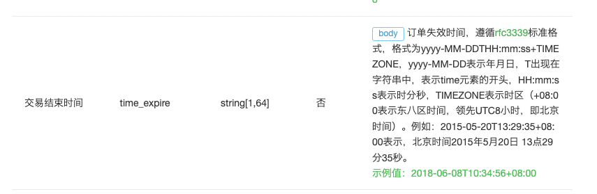

# OffsetDateTime

最近在看微信小程序JSAPI支付文档的时候，有这样一段：



其中在对过期时间格式化的时候，遇到问题了，经过查询资料，测试，提供了如下工具类，


比如你创建的订单2两小时过期，现在你可以这样

```java
LocalDateTime expireTime = LocalDateTime.now.plusHours(2);
OffsetDateTime offsetDateTime = DateTimeUtils.toOffsetDateTime(expireTime);
String result = DateTimeUtils.format(offsetDateTime, "uuuu-MM-dd'T'HH:mm:ssXXX");
System.out.println(result);
```


打印结果

> 2023-09-05T10:20:51+08:00