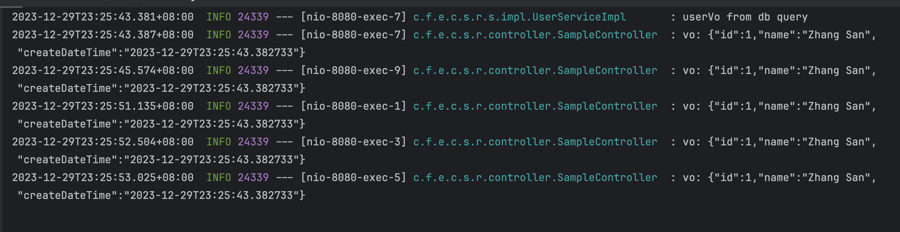
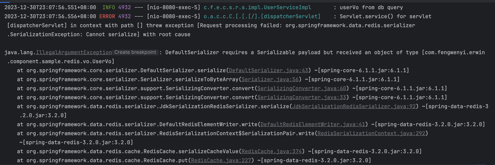
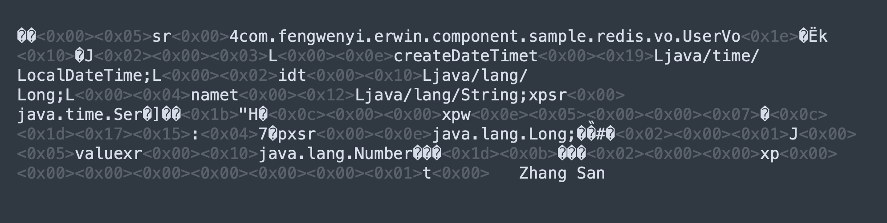
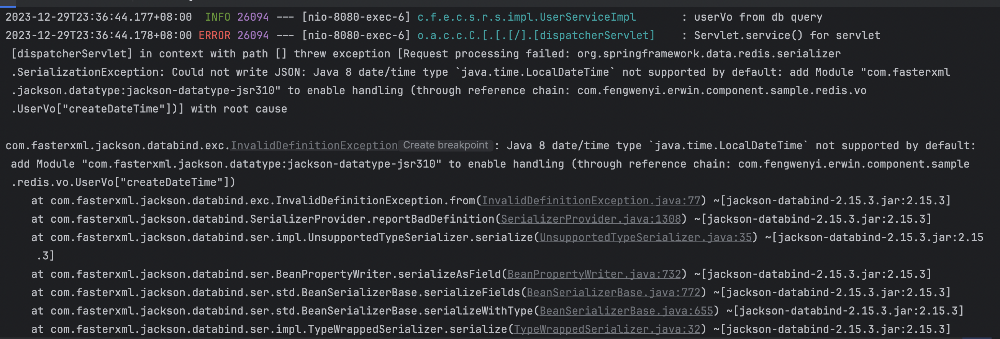
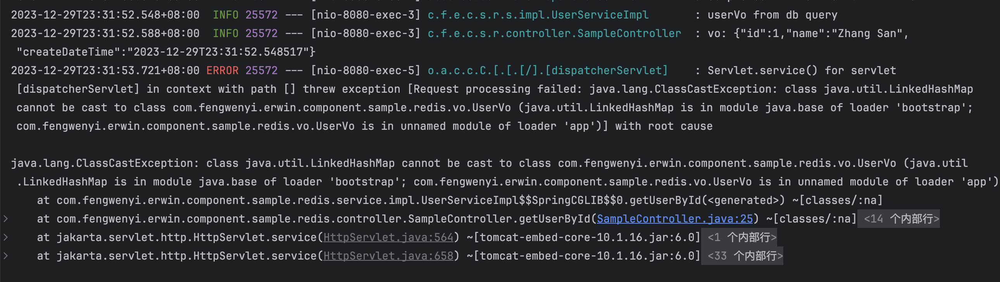

# Spring Data Redis对象缓存问题


相信在项目中，你一定是经常使用 Redis ，那么，你是怎么使用的呢？在使用时，有没有遇到同我一样，对象缓存序列化问题的呢？那么，你又是如何解决的呢？


## Redis 使用示例

添加依赖：

```xml
<dependency>
    <groupId>org.springframework.boot</groupId>
    <artifactId>spring-boot-starter-data-redis</artifactId>
</dependency>
```


在应用启动如何添加启用缓存注解（`@EnableCaching`）。


假如我们有一个用户对象（`UserVo`）：

```java
@Data
public class UserVo implements Serializable {

    @Serial
    private static final long serialVersionUID = 2215423070276994378L;

    private Long id;

    private String name;

    private LocalDateTime createDateTime;

}
```

这里，我们实现了 `Serializable` 接口。


在我们需要缓存的方法上，使用 `@Cacheable` 注解，就表示如果返回的对象不是 null 时，就会对其进行缓存，下次查询，首先会去缓存中查询，查到了，就直接返回，不会再去数据库查询，查不到，再去数据库查询。

```java
@Service
@Slf4j
public class UserServiceImpl implements IUserService {

    @Override
    @Cacheable(
            value = "sample-redis",
            key = "'user-'+#id",
            unless = "#result == null"
    )
    public UserVo getUserById(Long id) {

        log.info("userVo from db query");

        UserVo userVo = new UserVo();
        userVo.setId(1L);
        userVo.setName("Zhang San");
        userVo.setCreateDateTime(LocalDateTime.now());

        return userVo;
    }

}
```


核心代码：

```java
@Cacheable(
        value = "sample-redis",
        key = "'user-'+#id",
        unless = "#result == null"
)
```


模拟测试，再写一个测试接口：

```java
@RestController
@RequestMapping("/sample")
@RequiredArgsConstructor
@Slf4j
public class SampleController {

    private final IUserService userService;

    @GetMapping("/user/{id}")
    public UserVo getUserById(@PathVariable Long id) {

        UserVo vo = userService.getUserById(id);

        log.info("vo: {}", JacksonUtils.json(vo));

        return vo;
    }

}
```


我们再加上连接 redis 的配置：

```yaml
spring:
  data:
    redis:
      host: localhost
      port: 6379
```


测试：

```http
### getUserById
GET http://localhost:8080/sample/user/1
```





输出结果跟我们想的一样，第一次从数据库查，后面都从缓存直接返回。


总结一下：

1. 添加 `spring-boot-starter-data-redis` 依赖。

2. 使用启用缓存注解（`@EnableCaching`）。
3. 需要缓存的对象实现 `Serializable` 接口。
4. 使用 `@Cacheable` 注解缓存查询的结果。


## 遇到问题

在上面我们通过 spring boot 提供的 redis 实现了查询对象缓存这样一个功能，有下面几个问题：

1. 缓存的对象，必须序列化，不然会报错。
2. redis 存储的数据，看不懂，可以转成 json 格式吗？
3. 使用 Jackson 时，遇到特殊类型的字段会报错，比如 LocalDateTime。


第1个问题，如果对象没有实现 `Serializable `接口，会报错：




关键信息：

```
java.lang.IllegalArgumentException: DefaultSerializer requires a Serializable payload but received an object of type [xxx.xxx.UserVo]
```


我详细描述一下第3个问题，默认是使用 Jdk序列化 `JdkSerializationRedisSerializer`，redis 里面存的数据如下：



问题很明显，对象必须要实现序列化接口，存的数据不易查看，所以，改用 `GenericJackson2JsonRedisSerializer` ，这就有了第3个问题。


我们加上下面的配置，就能解决第2个问题。

```java
@Bean
public RedisCacheConfiguration redisCacheConfiguration() {
    return RedisCacheConfiguration
            .defaultCacheConfig()
            .serializeValuesWith(
                    RedisSerializationContext
                            .SerializationPair
                            .fromSerializer(RedisSerializer.json())
            );
}
```


下面看第三个问题的错误：




## 如何解决？


既然有了明确的错误提示，那也是好解决的，我们可以这样：

```java
@JsonDeserialize(using = LocalDateTimeDeserializer.class)		// 反序列化
@JsonSerialize(using = LocalDateTimeSerializer.class)		    // 序列化
private LocalDateTime createDateTime;
```


这样就可以了，我们看下redis里面存的数据：

```java
{"@class":"com.fengwenyi.erwin.component.sample.redis.vo.UserVo","id":1,"name":"Zhang San","createDateTime":[2023,12,29,23,44,3,479011000]}
```


其实到这里，已经解决了问题，那有没有更省心的办法呢？


## 解决办法

其实我们知道，使用的就是 Jackson 进行 json 转换，而 json 转换，遇到 LocalDateTime 问题时，我们配置一下 module 就可以了，因为默认用的 `SimpleModule`，我们改用 `JavaTimeModule` 就可以了。


这时候问题又来啦，错误如下：




这时候存的数据如下：

```json
{"id":1,"name":"Zhang San","createDateTime":"2023-12-29T23:31:52.548517"}
```


这就涉及到 Jackson 序列化漏洞的问题了，采用了白名单机制，我们就粗暴一点：

```java
jsonMapper.activateDefaultTyping(
  LaissezFaireSubTypeValidator.instance, 
  ObjectMapper.DefaultTyping.NON_FINAL
);
```


redis 存的数据如下：

```json
["com.fengwenyi.erwin.component.sample.redis.vo.UserVo",{"id":1,"name":"Zhang San","createDateTime":"2023-12-29T23:56:18.197203"}]
```


最后，来一段完整的 `RedisCacheConfiguration` 配置代码：


```java
@Bean
public RedisCacheConfiguration redisCacheConfiguration() {
    return RedisCacheConfiguration
            .defaultCacheConfig()
            .serializeValuesWith(
                    RedisSerializationContext
                            .SerializationPair
//                            .fromSerializer(RedisSerializer.json())
//                            .fromSerializer(
//                                    new GenericJackson2JsonRedisSerializer()
//                            )
                            .fromSerializer(redisSerializer())
            );
}

private RedisSerializer<Object> redisSerializer() {
    JsonMapper jsonMapper = new JsonMapper();
    JacksonUtils.configure(jsonMapper);
    jsonMapper.activateDefaultTyping(
            LaissezFaireSubTypeValidator.instance, 
            ObjectMapper.DefaultTyping.NON_FINAL
    );
    return new GenericJackson2JsonRedisSerializer(jsonMapper);
}
```


希望今天的分享对你有一定的帮助。