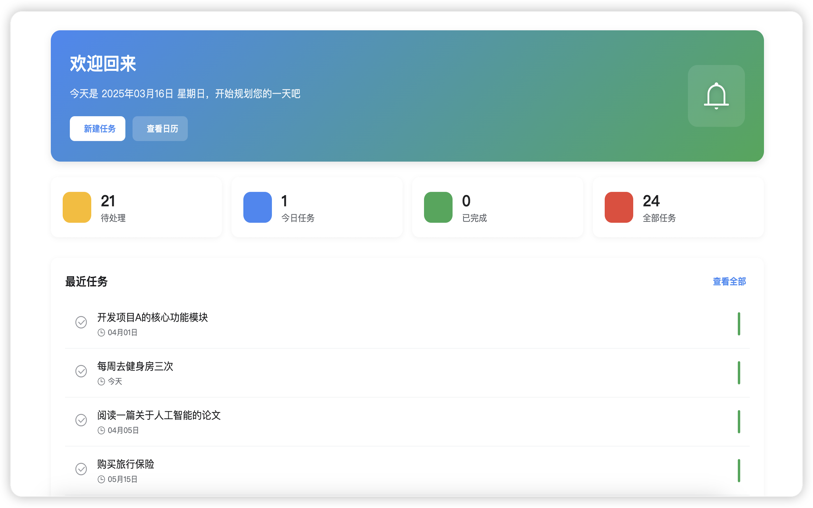
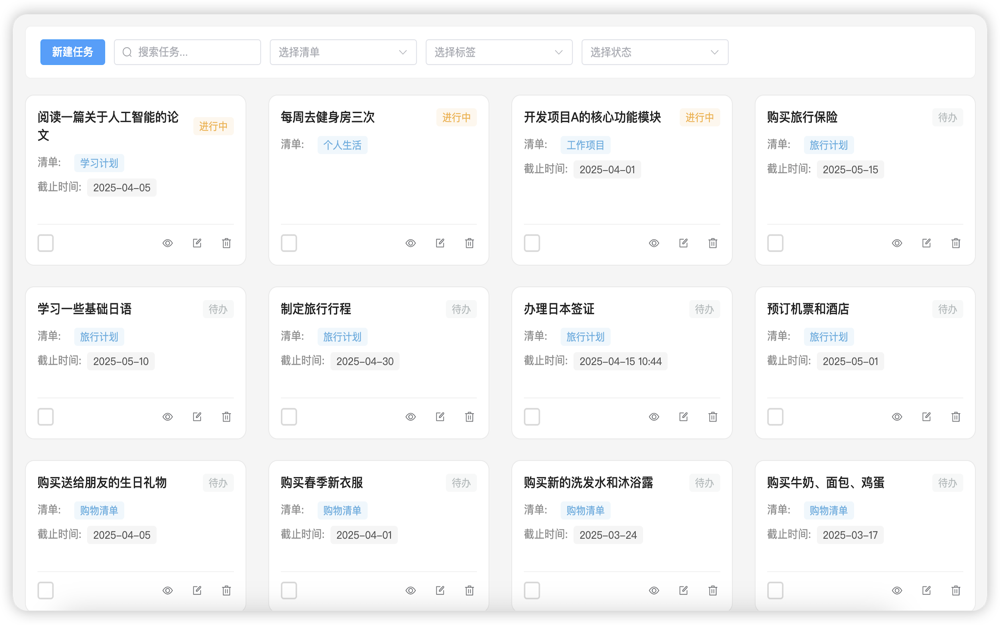
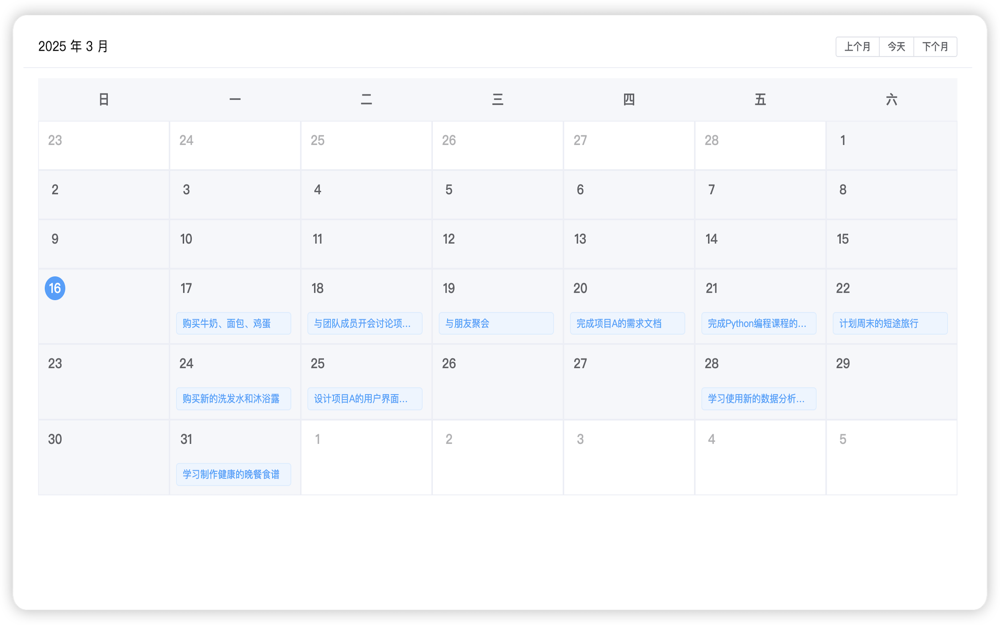

# 待办清单软件介绍

## 什么是待办清单软件？

待办清单软件是一个帮助用户管理日常任务和目标的工具。它能够让用户轻松记录、组织和追踪需要完成的事项，提高工作效率和时间管理能力。

## 核心功能

### 1. 任务管理
- 创建、编辑和删除任务
- 设置任务优先级
- 添加任务截止日期
- 标记任务完成状态

### 2. 任务分类
- 支持创建多个清单
- 按项目或类别组织任务
- 标签功能，方便任务分类

### 3. 提醒功能
- 任务到期提醒
- 自定义提醒时间
- 重复任务设置

### 4. 协作功能
- 任务分享
- 团队协作
- 任务委派

### 5. 数据同步
- 多设备同步
- 云端备份
- 离线使用

## 使用场景

1. **个人事务管理**
   - 日常待办事项
   - 学习计划
   - 生活目标

2. **工作项目管理**
   - 项目任务跟踪
   - 会议安排
   - 工作计划

3. **团队协作**
   - 任务分配
   - 进度跟踪
   - 团队目标管理

## 使用建议

1. 定期整理任务清单
2. 设置合理的任务优先级
3. 养成每日检查的习惯
4. 及时更新任务状态
5. 适当利用提醒功能

## 注意事项

1. 避免任务堆积过多
2. 合理规划任务时间
3. 定期备份重要数据
4. 及时处理过期任务
